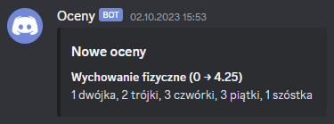

# oceny-backend
Self-hosted webhook/bot to monitor changes in class grades on VULCAN UONET+ e-register.

### Preview


### See also
Web frontend: [oceny-frontend-v2](https://github.com/kabuspl/oceny-frontend-v2)

## Installation
### Standalone
Requirements:  
- node.js 18 or later

Installation:
- Clone the repository and cd into it:  
```sh
git clone https://github.com/kabuspl/oceny-backend
cd oceny-backend
```
- Copy `.env.example` to `.env` and customize it to your needs:
```sh
cp .env.example .env
```
- Install packages:
```sh
npm install
```
- Start program:
```sh
node .
```

### Docker
Requirements:
- docker with docker compose
- system running on amd64 or arm64 cpu

Installation:
- Clone the repository and cd into it:  
```sh
git clone https://github.com/kabuspl/oceny-backend
cd oceny-backend
```
or download `docker-compose.yml`:
```sh
wget https://raw.githubusercontent.com/kabuspl/oceny-backend/master/docker-compose.yml
```
- Modify `docker-compose.yml` to your needs.  
- Start container:
```sh
docker-compose up -d
```